########### EDITING IN PROGRESS 
 
 
 ## Overview
This document presents the steps to analyze a subset (square located between 2000 and 4000 um on both axis) of the dataset [`Xenium Human Lymph node`](https://www.10xgenomics.com/datasets/human-lymph-node-preview-data-xenium-human-multi-tissue-and-cancer-panel-1-standard)  from 10XGenomics using the TranSpaceR pipeline. 
The analysis includes data curation, variable genes selection, clustering and visualization of results. 
## Directory Structure
```
/Spatial_atlas

          └── /Datasets
                   └── /Xenium
                          └── /Lymph_node
                                └── Xenium_Lymph_node_ExprMat.csv
                                └── Xenium_Lymph_node_Metadata.csv
          └── /Picture_pipeline
                   └── /Xenium
                          └── /Lymph_node
                                └── Saved Plots
                                └── /Variogram_plots
                                          └── Variogram plots
```
## Loading
```R
path = '~/Spatial_atlas/Datasets/Xenium/Lymph_node/'
Output_path = "~/Spatial_atlas/Picture_pipeline/Xenium/Lymph_node/"
Method = "Xenium"
Tissue = "Lymph_node"

Expression_file = read.delim(paste(path,"Xenium_Lymph_node_ExprMat.csv",sep =""),sep=",")
Meta_data = read.delim(paste(path,"Xenium_Lymph_node_Metadata.csv",sep =""),sep=",")

dim(Expression_file)
dim(Meta_data)
```
```
[1] 39047    539
[1] 39047     10
```
The dataset is loaded, if existing the columns of `Expression_file` containing unfit data must be removed. We should obtain a matrix that
exclusively contains RNA counts for each gene (539) across individual cells (39047). The expression matrix and the metadata file should have the same cells.

## Step 1: Quality control

```R
Meta_data = Compute_radius(Meta_data,Method)
QC1_results =  QC_RNA_size_threshold(Expression_file,Meta_data,Method,Tissue,Output_path)
QC2_results =  QC_Gene_threshold(Expression_file,Meta_data,Method,Tissue,Output_path)
print('Otsu's threshold is', QC2_results$Otsu_threshold)
```
```
[1] Otsu's threshold is 53
```
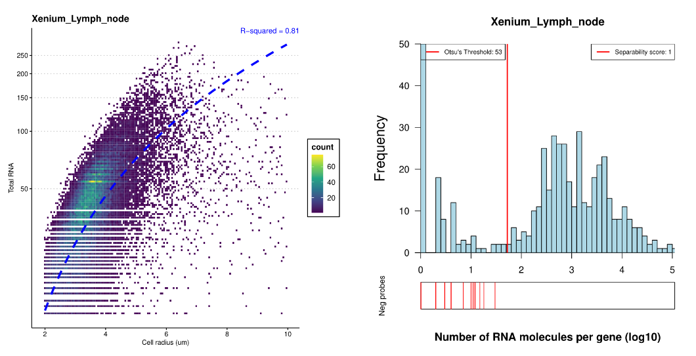
These two plots are saved in the output path. The 2D density plot from QC1, which illustrates the relationship between the number of transcripts
and the radius of cells,  the appropriate thresholds. 
From QC2, Otsu's threshold for the number of transcripts per gene is automatically computed and utilized within the `curate_data` function as below.
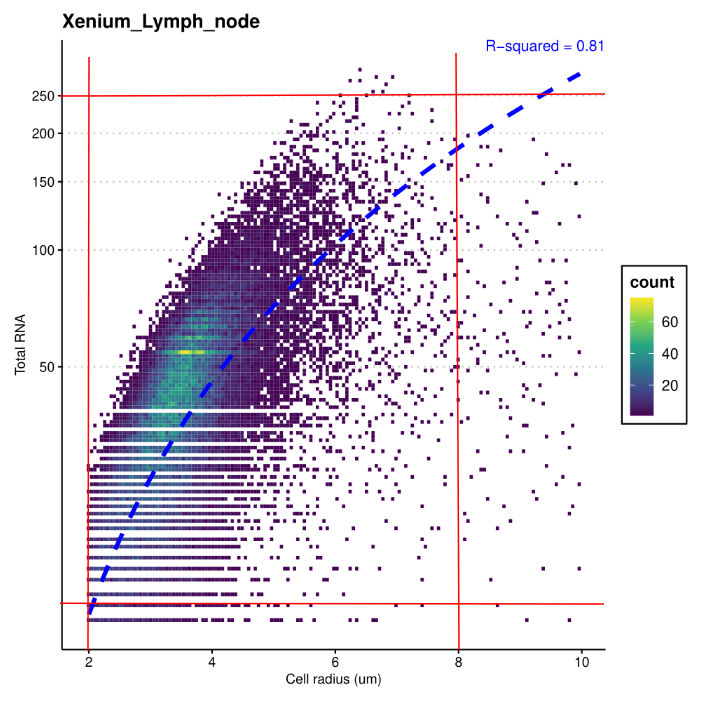

### Data curation 
```R
Data_curated = Curate_data(Expression_file,Meta_data,QC2_results,min_lib_size=10,max_lib_size=250,min_cell_radius=2,max_cell_radius=8)
Expression_file = Data_curated$Expression_file
Meta_data = Data_curated$Meta_data
dim(Expression_file)
dim(Meta_data)
```
```R
[1] 38804    376
[1] 38804    11
```
After curation, about 99% of initial cells and 69% of initial transcripts are kept for further analysis.

## Step 2 : Gene selection

Computation of scoring methods based on the total variance, zero proportion and spatial variance. The plots are saved in the provided `Output_path`. 
The selected genes from each scoring method are highlighted in red.

### Total variance
```R
Variance_computation = Excess_variance_ratio_NB(Expression_file,Output_path,Method,Tissue)
Variance_genes= Variance_computation$Selected_genes
```
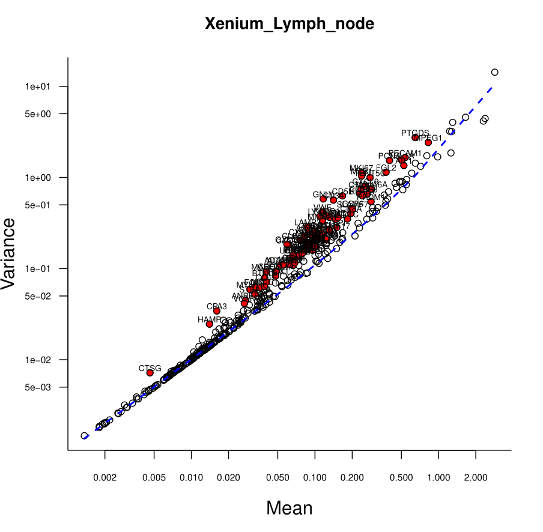

### Zero proportion genes
```R
Zero_score = Excess_zero_score_NB(Expression_file,Output_path,Method,Tissue)
Zero_genes = names(Zero_score[order(Zero_score,decreasing = TRUE)])[1:100]
```
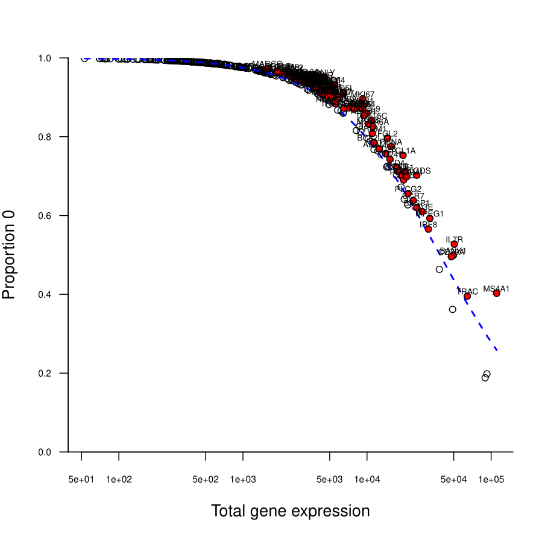

### Spatially variable genes

#### Geary's C
```R
Geary_computation = Geary_C_score(Expression_file,Meta_data,Output_path,Method,Tissue,pvalue = 0.01)
Geary_genes = Geary_computation$Selected_genes
```
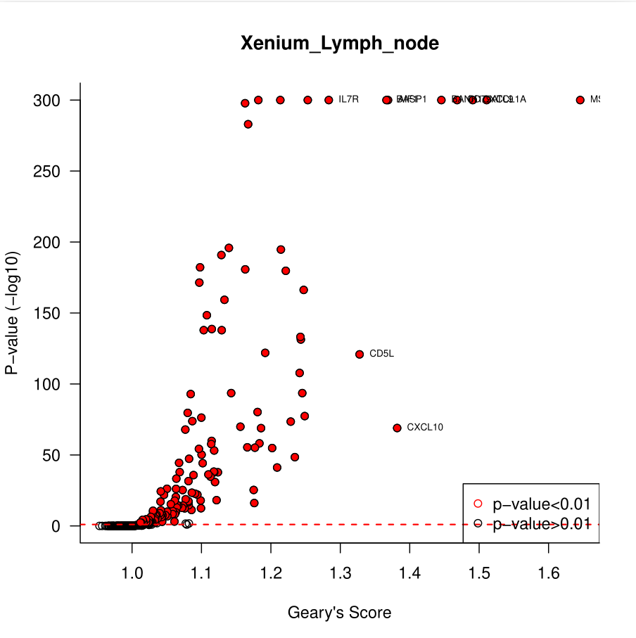

The plot depicting the correlation between the Spatial variance score and Total variance score can be saved in the output path. It shows a correlation of 0.302 between the two methods.

```R
Save_geary_variance_plot(Variance_computation,Geary_computation,Output_path)
```
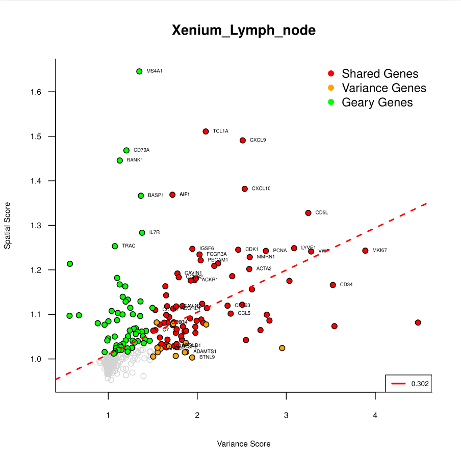

```R
Shared_genes = Select_genes(Selected_objects =list(Variance_genes,Zero_genes,Geary_genes),
                              Selected_names = c('Variance_genes','Zero_genes','Geary_genes'))
```
The selection of all the genes selected by at least one method is illustrated by this Upset Plot (saved automatically).

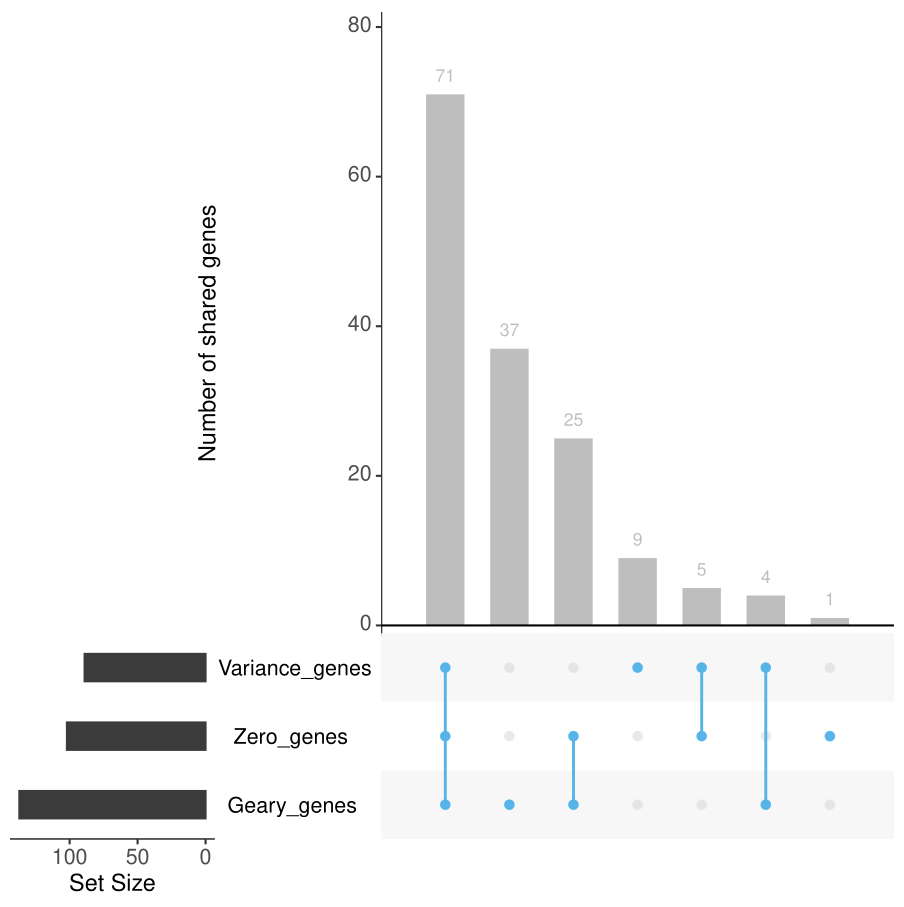

## Step 3 : Clustering and annotation results
### Clustering
```R
Clustering_output = Clusters_maker(Expression_file,Shared_genes)
  Clustering = Clustering_output$Clustering  
  PCA_data = Clustering_output$PCA_data
  Mean_expression = Clustering_output$Mean_expression
```
The ouptuts of the function Clusters_maker() include the list of cluster affiliation, the PCA results and the mean expression of genes within each cluster file.
```R
Save_heatmap_markers(Expression_file, object = Clustering,Output_path,Method,Tissue)
```
```R
library(spatstat)
Save_tissue_visualization(Meta_data,object = Clustering, Output_path,Method,Tissue,scaling_factor=4)
```
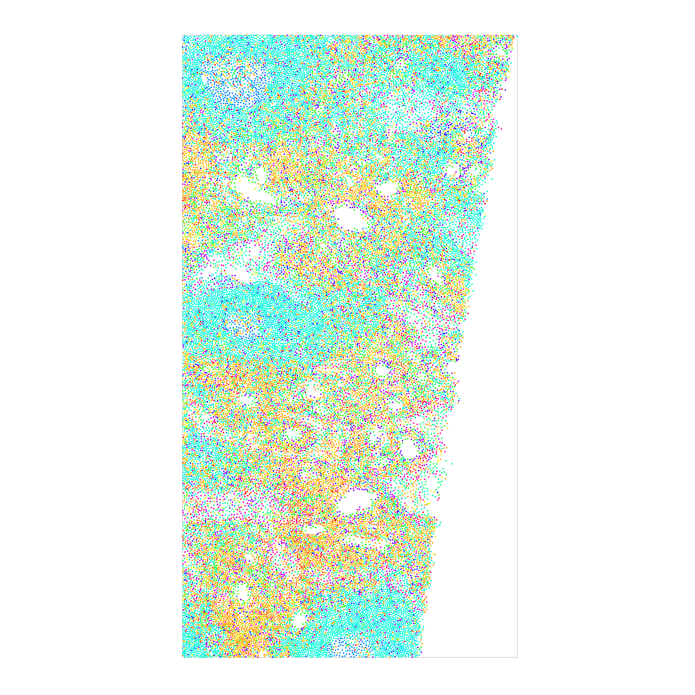
### Scimilarity Annotation
```R
  Annotation_cells_renamed = Load_scimilarity_results(path,celltype_threshold=0.01)
  Save_annotation_plot(Annotation_cells_renamed,Output_path,Method,Tissue)
``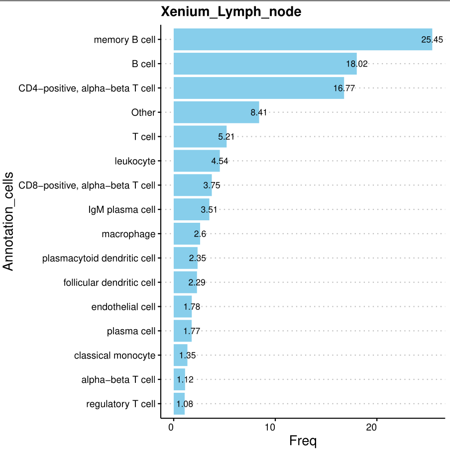

```R
Save_heatmap_markers(Expression_file, object = Annotation_cells_renamed, Output_path,Method,Tissue)
```
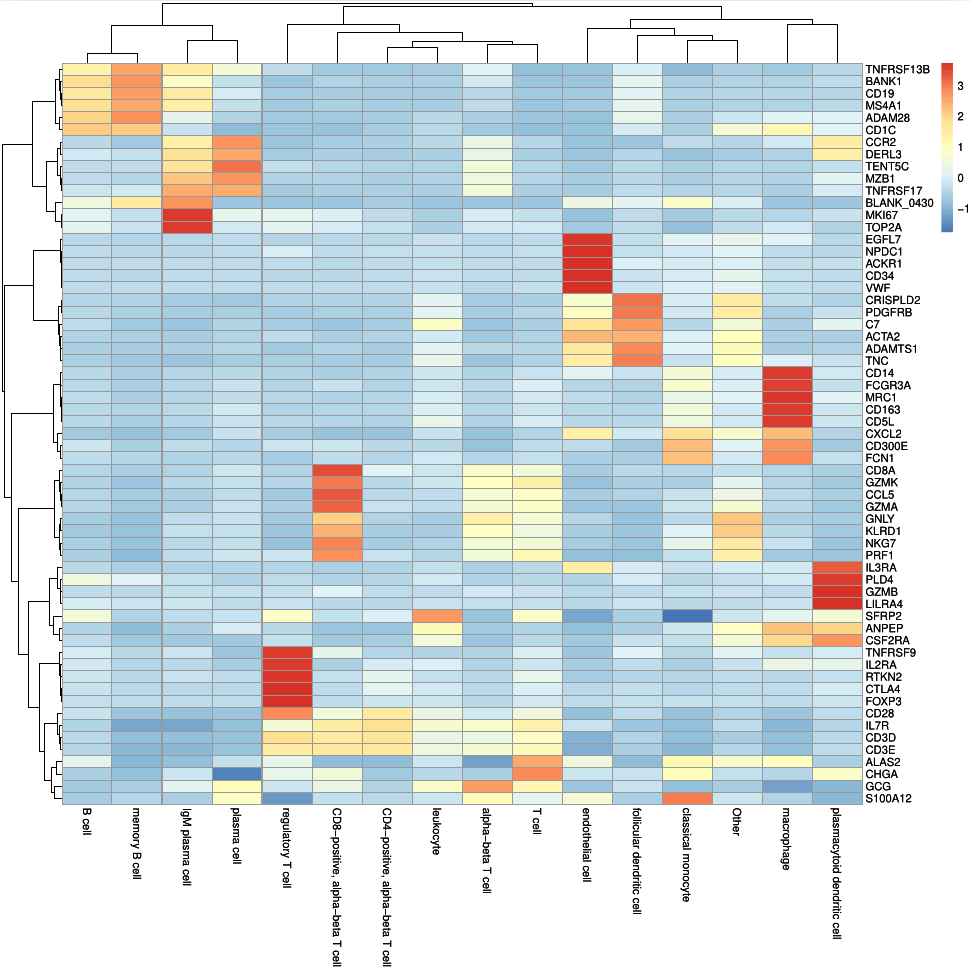

```R
Save_boxplot(Data_correction,object = Annotation_cells_renamed,gene = 'MS4A1', Output_path,Method,Tissue)
```


## Step 4 : Comparison KNN Clustering and Annotation

```R
Save_comparison_plots(Clustering,PCA_data,Annotation_cells_renamed,Output_path,Method,Tissue,scaling_factor=1.5)
```

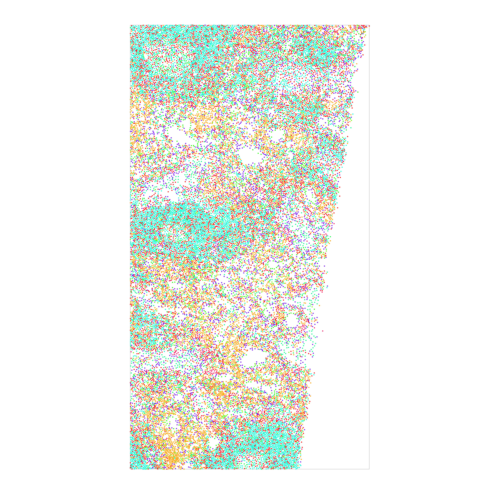


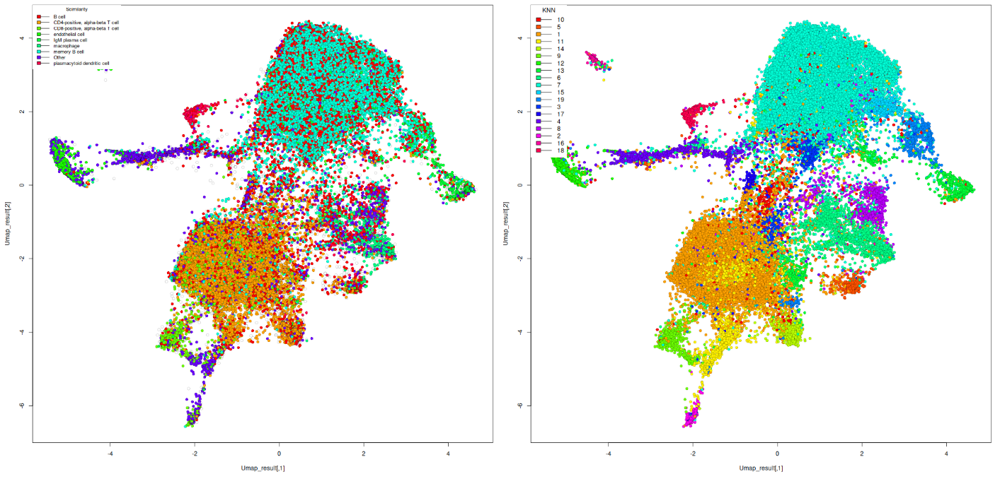

```R
Save_dendogram(Clustering,Annotation_cells_renamed,Output_path,Method,Tissue)
```
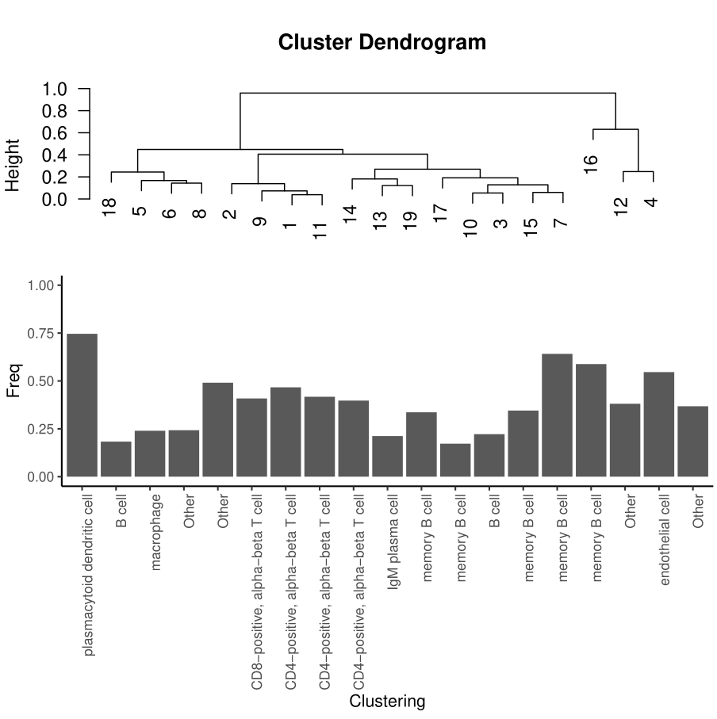


### Notes:
- Some dependencies can be missed when loading the package and should be installed manually.
- The analysis can be expanded with additional steps or insights as needed.
