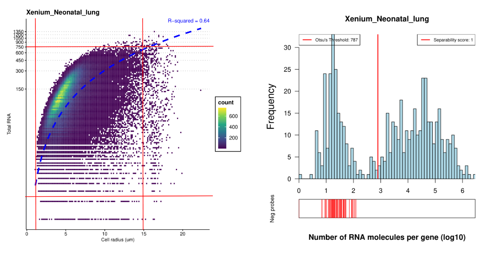
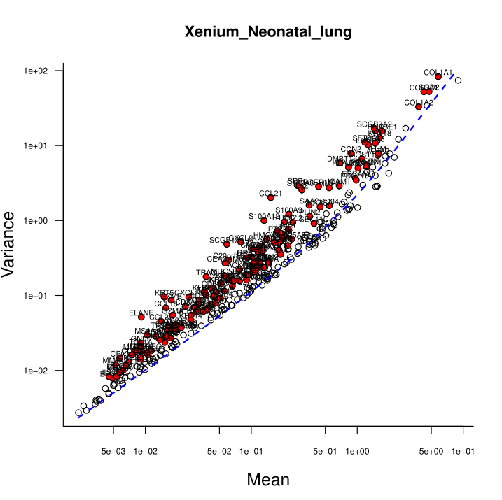
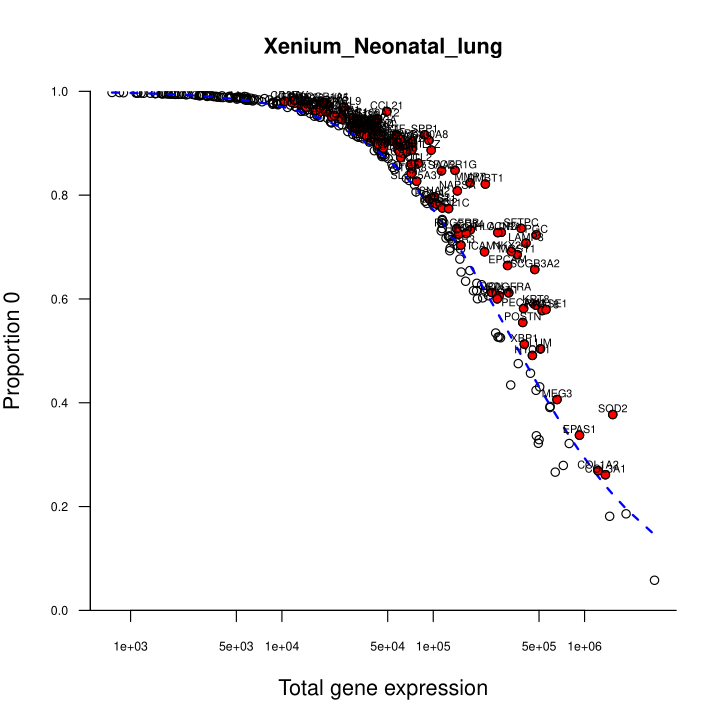
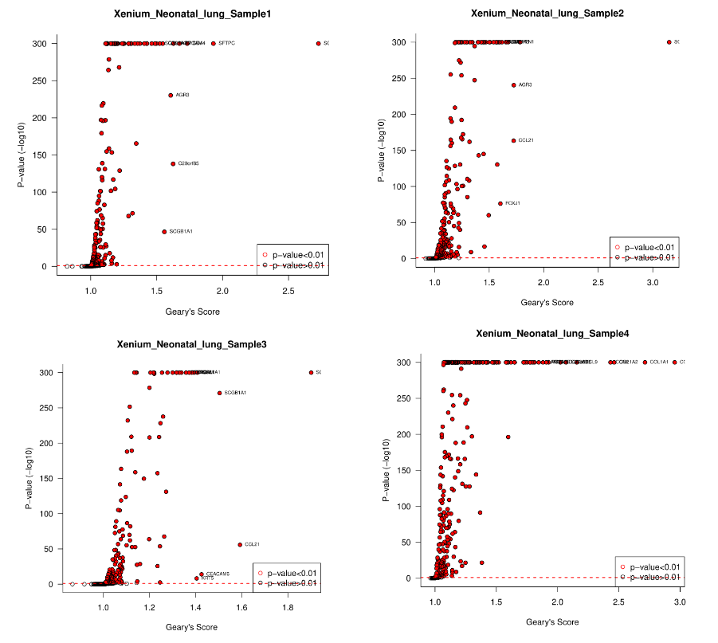
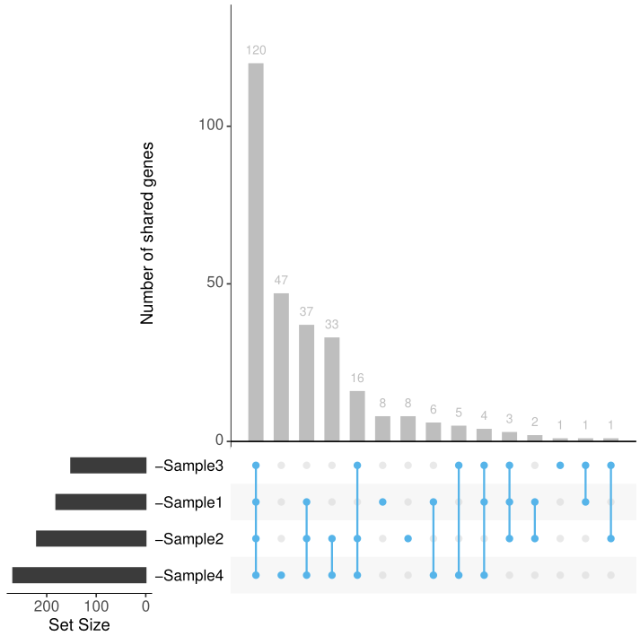
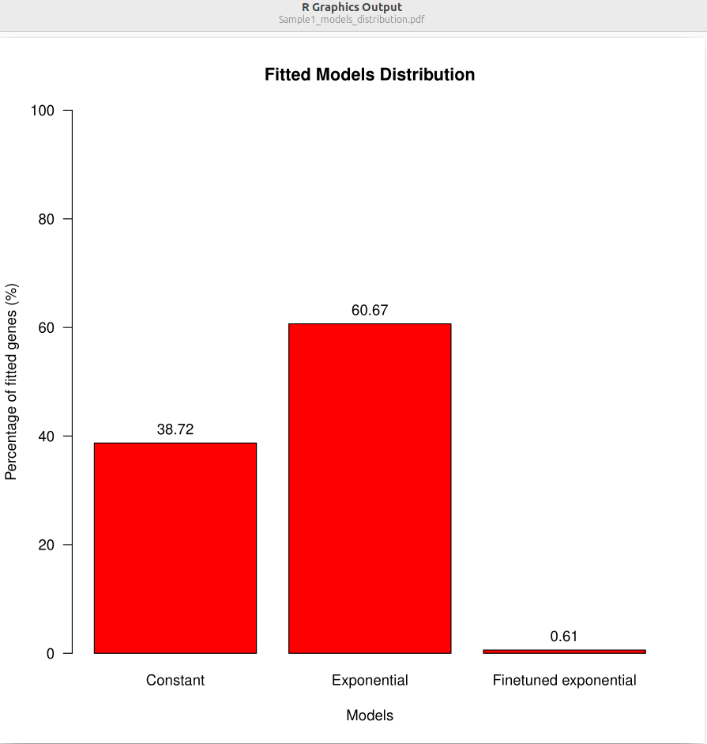
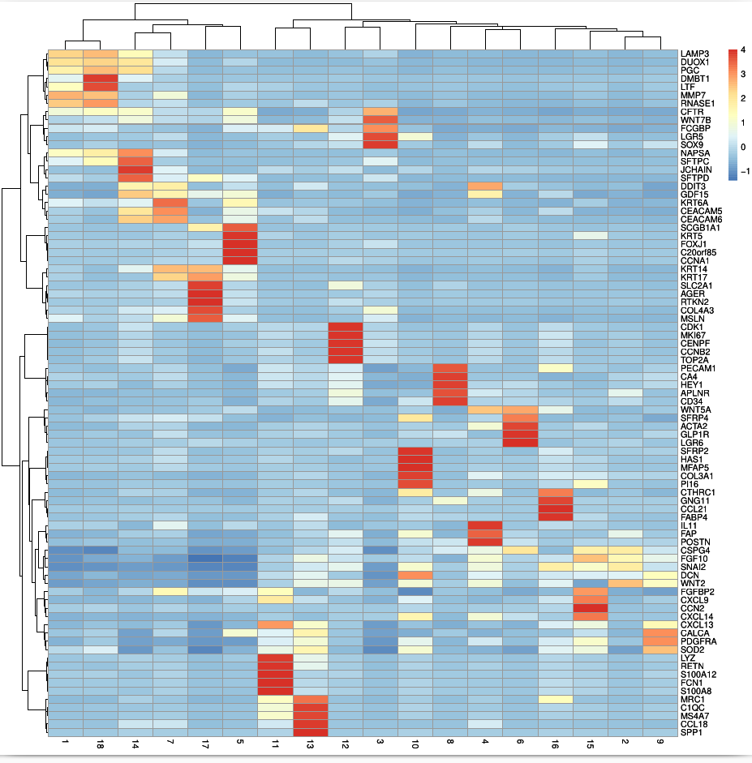
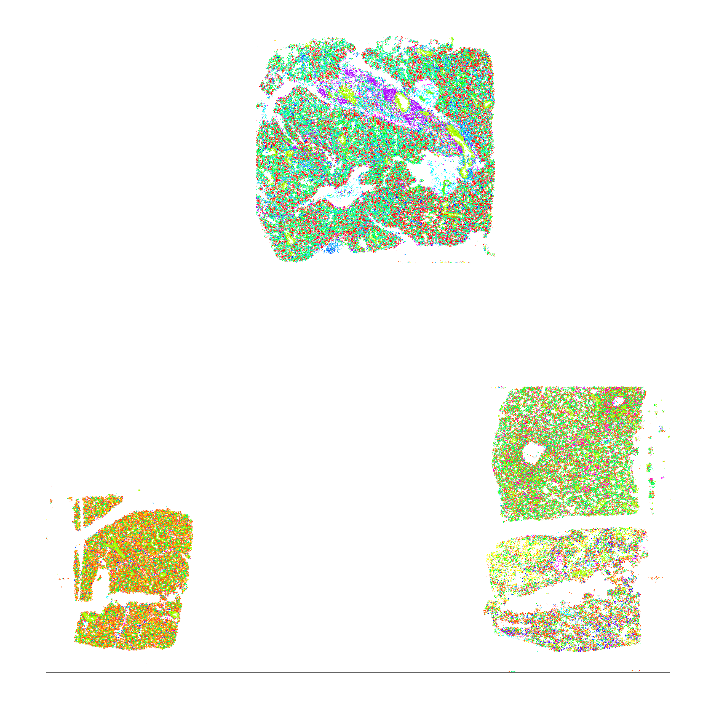

## Overview
This document presents the steps to analyze 4 samples from the reduced dataset [Xenium Acute Neonatal Lung injury - Slide 2 ](https://www.ncbi.nlm.nih.gov/geo/query/acc.cgi?acc=GSE297945) using the TranspaceR pipeline. 

## Loading
```R
path = '~/Spatial_atlas/Datasets/Xenium/Neonatal_lung/'
Output_path = '~/Spatial_atlas/Picture_pipeline/Xenium/Neonatal_lung/'
Method = "Xenium"
Tissue = "Neonatal_lung"

Expression_file = read.csv(paste(path, "Neonatal_lung_ExprMat.csv", sep = ""), header = TRUE)
Meta_data = read.csv(paste(path,"Neonatal_lung_Metadata.csv",sep =""), header = TRUE)

# METADATA MUST CONTAIN A SAMPLE COLUMN
dim(Expression_file)
dim(Meta_data)
```
```
[1] 328078    541
[1] 328078     11
```
## Step 1: Quality control

The analysis is performed on the whole dataset.

```R
Meta_data = Compute_radius(Meta_data,Method)
QC1_results =  QC_RNA_size_threshold(Expression_file,Meta_data,Method,Tissue,Output_path)
QC2_results =  QC_Gene_threshold(Expression_file,Meta_data,Method,Tissue,Output_path)
print('Otsu's threshold is', QC2_results$Otsu_threshold)
```
```
[1] Otsu's threshold is 786.8563
```


### Data curation 
```R
Data_curated = Curate_data(Expression_file,Meta_data,QC2_results,min_lib_size=10,max_lib_size=750,min_cell_radius=2,max_cell_radius=15)
Expression_file = Data_curated$Expression_file
Meta_data = Data_curated$Meta_data
dim(Expression_file)
dim(Meta_data)
```
```R
[1] 322770    328
[1] 322770    11
```

## Step 2 : Gene selection

### Total variance
```R
Variance_computation = Excess_variance_ratio_NB(Expression_file,Output_path,Method,Tissue)
Variance_genes= Variance_computation$Selected_genes
```


### Zero proportion genes
```R
Zero_score = Excess_zero_score_NB(Expression_file,Output_path,Method,Tissue,P_value_threshold=0.01,Delta_threshold = 0.01)
Zero_genes = Zero_score_computation$Selected_genes
```


### Spatially variable genes
This step is performed on each sample separately.
To compute the Geary's C score and variograms for each sample, versions of functions *Geary_C_score* and *Compute_variogram* are implemented.

#### Geary's C
```R
Geary_computation = Geary_C_score_multiple(Expression_file,Meta_data,Output_path,Method,Tissue,pvalue=0.01)
[1] "Sample1"
Computing Geary's C score for each gene 
+++++++++++++++++++++++++++++++++++++++++++++++++++++++++++++++++++++++++++++++++++++++++++++++++++++++++++++++++++++++++++++++++
 done ![1] "Sample4"
Computing Geary's C score for each gene 
+++++++++++++++++++++++++++++++++++++++++++++++++++++++++++++++++++++++++++++++++++++++++++++++++++++++++++++++++++++++++++++++++
 done ![1] "Sample2"
Computing Geary's C score for each gene 
+++++++++++++++++++++++++++++++++++++++++++++++++++++++++++++++++++++++++++++++++++++++++++++++++++++++++++++++++++++++++++++++++
 done ![1] "Sample3"
Computing Geary's C score for each gene 
+++++++++++++++++++++++++++++++++++++++++++++++++++++++++++++++++++++++++++++++++++++++++++++++++++++++++++++++++++++++++++++++++
 done !
```
```R
> Geary_computation$Sample3
  [1] "SCGB3A2"  "CCL21"    "SCGB1A1"  "CEACAM6"  "COL1A1"   "KRT5"     "NKX2.1"   "EPCAM"    "COL3A1"   "RTKN2"    "VEGFA"   
 [12] "MSLN"     "ICAM1"    "AGER"     "VIM"      "KRT8"     "AGR3"     "ACKR1"    "APLNR"    "COL1A2"   "KRT18"    "SFRP2"   
 [23] "GLP1R"    "SFTPD"    "KRT15"    "PTGDS"    "FN1"      "ACTA2"    "LUM"      "CD44"     "MGST1"    "SLC2A1"   "C20orf85"
 [34] "POSTN"    "SFTPC"    "S100A9"   "FOXJ1"    "EPAS1"    "SPARCL1"  "HES1"     "PLVAP"    "PECAM1"   "LAMP3"    "DCN"     
 [45] "ITGA3"    "XBP1"     "CCN2"     "HSPA5"    "AKR1C1"   "MEG3"     "IL7R"     "CD34"     "GKN2"     "EGFR"     "KRT17"   
 [56] "RNASE1"   "HEY1"     "SPRY2"    "HIST1H1C" "CD68"     "SLC25A37" "AKR1C2"   "FCGR3A"   "ITGB1"    "SOX4"     "FCER1G"  
 [67] "CCL2"     "GNG11"    "COL4A3"   "CFTR"     "PGC"      "ATF4"     "NAPSA"    "BCL2L1"   "PKM"      "HMGA1"    "KDR"     
 [78] "CCNA1"    "WFDC2"    "ATF3"     "HIF1A"    "SEC11C"   "PDIA3"    "CDK1"     "PDGFRB"   "SNCA"     "KIT"      "FGF2"    
 [89] "PLIN2"    "RHOA"     "HLA.DRA"  "PDGFRA"   "CA4"      "GDF15"    "RAMP2"    "CDH26"    "CTNNB1"   "CST3"     "ZEB1"    
[100] "YAP1"     "PDIA4"    "FABP4"    "AIF1"     "IDH1"     "CTHRC1"   "AXL"      "DDIT3"    "TGFB1"    "WNT5A"    "CLDN5"   
[111] "SOX2"     "LMAN1"    "NUCB2"    "ITGB6"    "PPARG"    "RSPO3"    "CXCL14"   "FGF7"     "STAT1"    "KRT14"    "IRF1"    
[122] "SOD2"     "TGFB2"    "ITM2C"    "UGDH"     "BMPR2"    "HERPUD1"  "SFTA2"    "NUTF2"    "SFRP4"    "SMAD4"    "BMP4"    
[133] "SNAI2"    "CD4"      "WNT2"     "WWTR1"    "IFIT1"    "HAS2"     "ERLEC1"   "HYOU1"    "UBE2J1"   "GSR"      "GCLM"    
[144] "NHSL2"    "PDIA6"    "SPCS2"    "ANKRD28"  "SSR3"     "CSPG4"    "SPCS3"    "AXIN2"

# To select the spatially variable genes from all samples
Geary_genes = unique(unlist(Geary_computation))
```


The Upset plot of the shared geary selected genes across the samples is saved in the output path.


#### Variogram 
For each sample the fitting parameters and distribution are saved, a variogram plots folder is created.
```R
Variogram_computation = Compute_variogram_multiple(Expression_file,Meta_data,automatic_pad=FALSE,n_pad=100,save_plot=TRUE,ncores=5,Output_path)
Variogram_genes = unique(unlist(Variogram_computation))
```


## Step 3 : Clustering and annotation results

From here, we resume performing the analysis on the whole dataset. 

### Clustering
```R
Clustering_output = Clusters_maker(Expression_file, Shared_genes, K=30, metric_used="L2", nThreads = 20, resolution = 1)
Clustering = Clustering_output$Clustering  
PCA_data = Clustering_output$PCA_data
Mean_expression = Clustering_output$Mean_expression
Data_correction = Clustering_output$Data_correction
Log2FC_table = Clustering_output$Log2FC_table
```
```R
Save_heatmap_markers(Expression_file, object = Clustering,Output_path,Method,Tissue,name_object = 'Clustering')
```


```R

Save_tissue_visualization(Meta_data,object = Clustering,Output_path,Method,Tissue,name_object = 'Clustering',scaling_factor=1.5)
```




#### For more steps refer to the one sample tutorial [here](Tutorial_TranspaceR).

